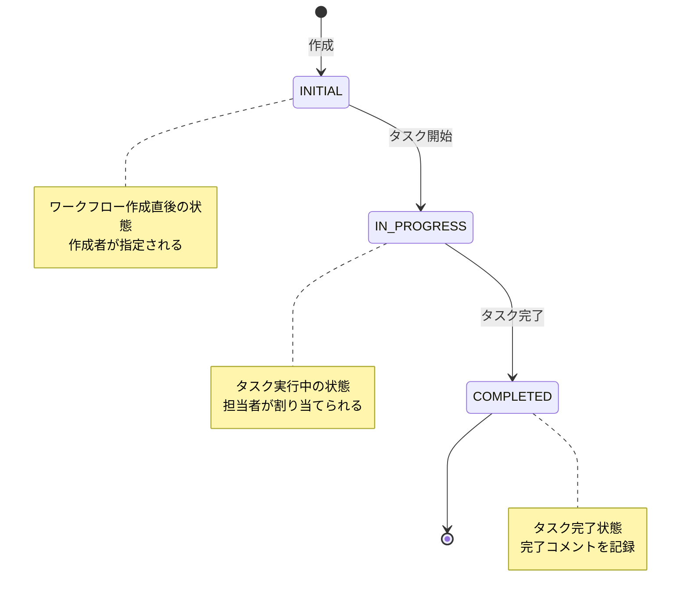
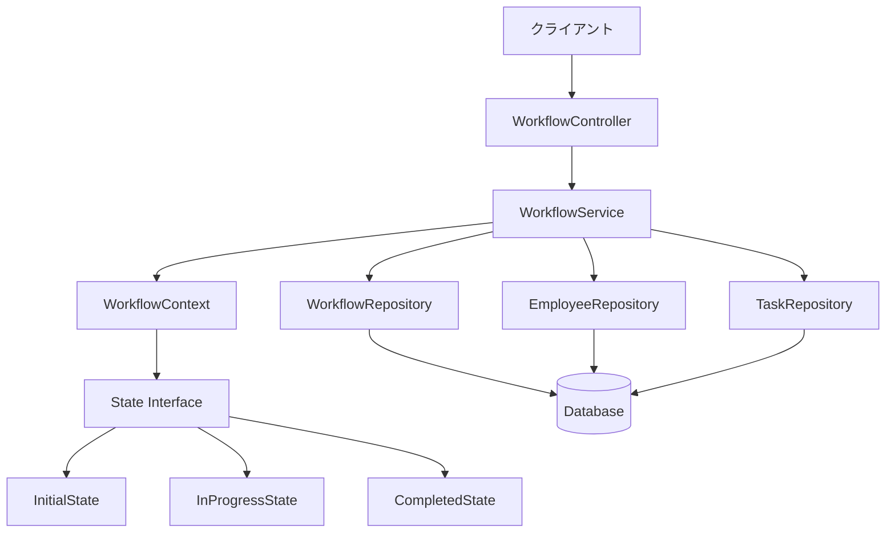

# Simple Workflow Engine

このプロジェクトは、Stateパターンを使用した社内向けワークフローエンジンの実装です。SpringBootとReactを使用したWebアプリケーションとして実装されています。

## 機能一覧

- ワークフロー管理
  - ワークフローの作成（タイトル、説明付き）
  - 担当者の割り当て
  - 状態遷移の管理
  - 作業履歴の記録

- 社員管理
  - 社員情報の管理
  - 部署、役職の管理
  - 担当タスクの追跡

- タスク管理
  - タスクの作成と割り当て
  - 実行状況の追跡
  - コメントの記録
  - 完了報告

## システム構成図

### 状態遷移図



### システムアーキテクチャ



## 技術スタック

### バックエンド
- Java 17
- Spring Boot 3.2.2
- Spring Web
- Spring Data JPA
- H2 Database (開発用)
- Lombok

### フロントエンド
- React 18
- TailwindCSS
- Radix UI
- React Query
- Lucide Icons

## プロジェクトの構造

```
my-java-workflow-app/
├── frontend/                # Reactフロントエンド
│   ├── src/
│   │   ├── components/     # Reactコンポーネント
│   │   ├── services/       # APIサービス
│   │   └── lib/           # ユーティリティ
│   └── public/
└── src/                    # Javaバックエンド
    └── main/
        └── java/
            └── com/simultechnology/workflow/
                ├── controller/      # REST APIコントローラー
                ├── service/         # ビジネスロジック
                ├── repository/      # データアクセス
                ├── entity/          # エンティティ
                ├── dto/            # データ転送オブジェクト
                └── state/          # 状態パターン実装
```

## ビルドと実行方法

### バックエンド

#### 前提条件
- JDK 17以上
- Maven 3.6以上

#### ビルド手順
```bash
mvn clean install
```

#### 実行方法
```bash
mvn spring-boot:run
```

サーバーは http://localhost:9480 で起動します。

### フロントエンド

#### 前提条件
- Node.js 16以上
- npm 8以上

#### インストール
```bash
cd frontend
npm install
```

#### 実行方法
```bash
npm start
```

フロントエンドは http://localhost:3000 で起動します。

## API仕様

### 1. ワークフロー管理

#### ワークフロー作成
```
POST /api/workflow
Content-Type: application/json

{
  "creatorId": 1,
  "title": "新規プロジェクト計画",
  "description": "新規プロジェクトの計画書作成"
}
```

#### ワークフロー一覧取得
```
GET /api/workflow/list?page=0&size=10
```

#### ワークフロー詳細取得
```
GET /api/workflow/{workflowId}
```

#### ワークフロー処理
```
POST /api/workflow/{workflowId}/process
```

### 2. タスク管理

#### タスク割り当て
```
POST /api/tasks/assign
Content-Type: application/json

{
  "workflowId": "xxx",
  "employeeId": 1,
  "taskName": "仕様レビュー",
  "taskDescription": "新機能の仕様書レビュー"
}
```

#### タスク完了
```
POST /api/tasks/{taskId}/complete
Content-Type: application/json

{
  "comments": "レビュー完了。問題なし。"
}
```

### 3. 社員管理

#### 社員一覧取得
```
GET /api/employees
```

#### 社員登録
```
POST /api/employees
Content-Type: application/json

{
  "employeeCode": "EMP001",
  "name": "山田太郎",
  "department": "開発部",
  "position": "主任",
  "email": "yamada@example.com"
}
```

## データベース管理

### H2 Console
開発環境では、H2 Consoleを使用してデータベースを直接確認できます：
- URL: http://localhost:9480/h2-console
- JDBC URL: `jdbc:h2:mem:workflowdb`
- Username: `sa`
- Password: (空白)

### 初期データ
アプリケーション起動時に、以下の初期データが登録されます：
- サンプル社員データ
- 基本設定データ

## 拡張ポイント

このワークフローエンジンは以下のような拡張が可能です：

1. ワークフロー機能の拡張
   - 条件分岐の追加
   - 並行処理の実装
   - タイマーイベントの追加

2. ユーザー管理の強化
   - 認証・認可の実装
   - ロールベースの権限管理
   - 組織階層の管理

3. 通知機能の追加
   - メール通知
   - Slack連携
   - カレンダー連携

4. レポーティング機能
   - 進捗レポート
   - パフォーマンス分析
   - 工数管理

## ライセンス

このプロジェクトはMITライセンスの下で公開されています。