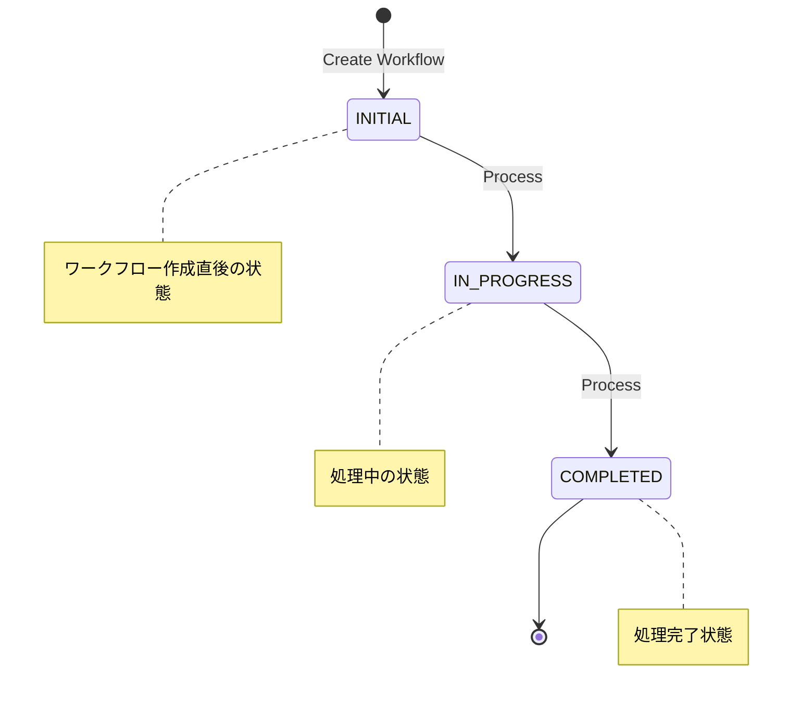
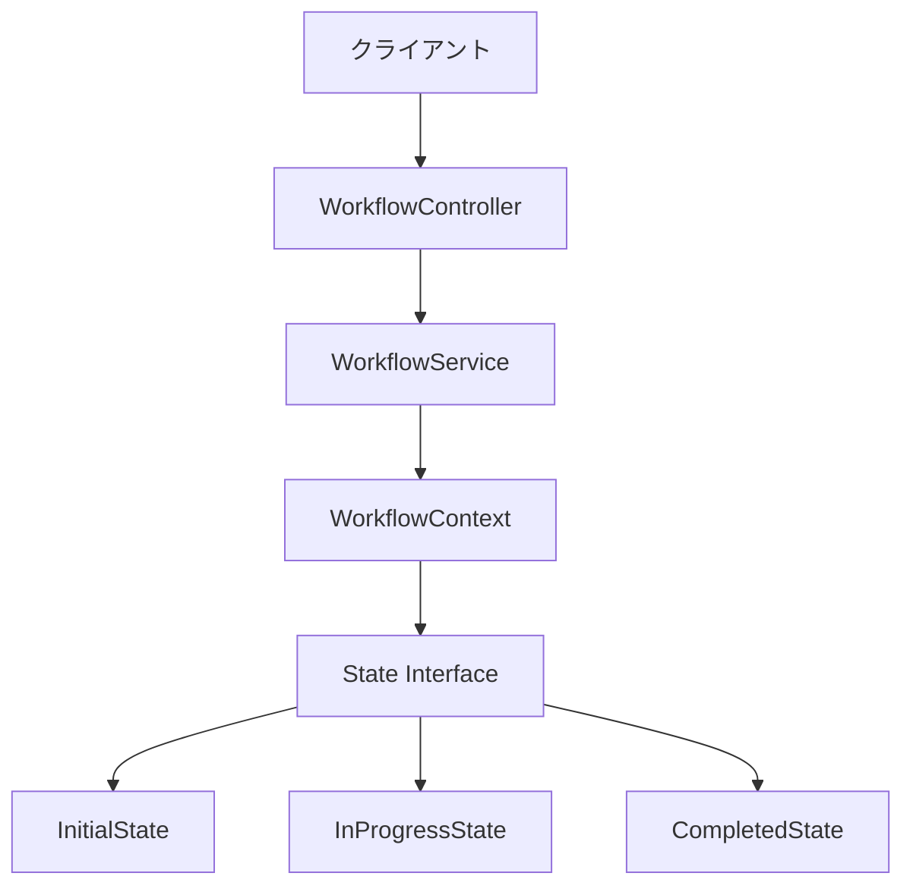

# Simple Workflow Engine

このプロジェクトは、Stateパターンを使用したシンプルなワークフローエンジンの実装です。SpringBootフレームワークを使用してRESTful APIとして実装されています。

## システム構成図

状態遷移図:



システムアーキテクチャ:



## 技術スタック

- Java 17
- Spring Boot 3.2.2
- Maven
- Spring Web
- Spring Data JPA
- H2 Database (開発用)
- Lombok

## プロジェクトの構造

```
my-java-workflow-app/
├── src/
│   └── main/
│       └── java/
│           └── com/
│               └── simultechnology/
│                   └── workflow/
│                       ├── WorkflowApplication.java
│                       ├── controller/
│                       │   └── WorkflowController.java
│                       ├── service/
│                       │   └── WorkflowService.java
│                       └── state/
│                           ├── State.java
│                           ├── WorkflowContext.java
│                           ├── InitialState.java
│                           ├── InProgressState.java
│                           └── CompletedState.java
└── pom.xml
```

## ビルドと実行方法

### 前提条件

- JDK 17以上
- Maven 3.6以上

### ビルド手順

```bash
mvn clean install
```

### 実行方法

```bash
mvn spring-boot:run
```

アプリケーションは デフォルトで http://localhost:9480 で起動します。

## API仕様

### 1. 新規ワークフロー作成

```
POST /api/workflow
```

**レスポンス例:**
```json
"550e8400-e29b-41d4-a716-446655440000"
```

### 2. ワークフロー処理の実行

```
POST /api/workflow/{workflowId}/process
```

**パスパラメータ:**
- workflowId: ワークフローのUUID

### 3. ワークフローの状態取得

```
GET /api/workflow/{workflowId}/state
```

**パスパラメータ:**
- workflowId: ワークフローのUUID

**レスポンス例:**
```json
"IN_PROGRESS"
```

## 使用例

### cURLを使用した例

1. 新規ワークフロー作成:
```bash
curl -X POST http://localhost:9480/api/workflow
```

2. ワークフロー処理の実行:
```bash
curl -X POST http://localhost:9480/api/workflow/{workflowId}/process
```

3. ワークフローの状態取得:
```bash
curl -X GET http://localhost:9480/api/workflow/{workflowId}/state
```

## 状態遷移の仕組み

このワークフローエンジンは以下の状態を持ちます：

1. **INITIAL**: 初期状態
   - ワークフロー作成直後の状態
   - 次の状態: IN_PROGRESS

2. **IN_PROGRESS**: 処理中状態
   - 実際の処理が行われている状態
   - 次の状態: COMPLETED

3. **COMPLETED**: 完了状態
   - 全ての処理が完了した状態
   - 最終状態

## 拡張ポイント

このワークフローエンジンは以下のような拡張が可能です：

1. **永続化の追加**
   - JDBCによるデータベース永続化
   - 状態履歴の保存

2. **状態遷移ルールの拡張**
   - 条件付き遷移の追加
   - 複数の遷移パスの実装

3. **イベント処理**
   - 状態変更時のイベント通知
   - 外部システムとの連携

4. **セキュリティ**
   - ユーザー認証の追加
   - アクセス制御の実装

5. **モニタリング**
   - 状態遷移の監視
   - パフォーマンス計測

## トラブルシューティング

### よくある問題と解決方法

1. アプリケーションが起動しない
   - Javaのバージョンが17以上であることを確認
   - ポート9480が使用可能であることを確認

2. ワークフローIDが見つからない
   - 正しいUUIDが指定されているか確認
   - ワークフローが正常に作成されているか確認

## ライセンス

このプロジェクトはMITライセンスの下で公開されています。